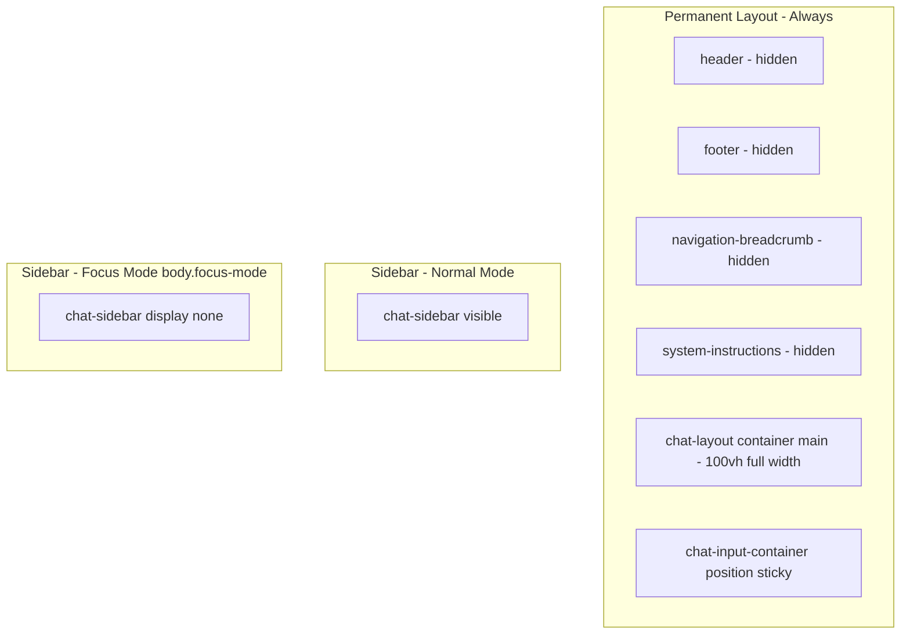

# Chat Layout Fix Plan for Another Cursor Agent

## References Found

The chat layout work is documented in these files:

| Document                                                                                           | Purpose                                                                                                                                                                                           |
| -------------------------------------------------------------------------------------------------- | ------------------------------------------------------------------------------------------------------------------------------------------------------------------------------------------------- |
| [docs/chat-composer-structural-fix-2025-10-28.md](docs/chat-composer-structural-fix-2025-10-28.md) | Root cause: composer outside flex container; fix: move inside `.chat-main`                                                                                                                        |
| [docs/chat-composer-FINAL-2025-10-28.md](docs/chat-composer-FINAL-2025-10-28.md)                   | Final architecture: CSS cascade, padding fallback                                                                                                                                                 |
| [docs/sticky-composer-fix-2025-10-28.md](docs/sticky-composer-fix-2025-10-28.md)                   | Composer uses `position: sticky`; `updateComposerPadding()` for both modes                                                                                                                        |
| [docs/chat-sidebar-padding-fixes-2025-10-28.md](docs/chat-sidebar-padding-fixes-2025-10-28.md)     | Sidebar padding and pointer-events                                                                                                                                                                |
| [docs/COMPLETE-SCROLL-CODE-AUDIT.md](docs/COMPLETE-SCROLL-CODE-AUDIT.md)                           | Scroll/padding logic and functions                                                                                                                                                                |
| [templates/chat/view.html](templates/chat/view.html)                                               | Inline CSS for layout (lines 9–26), sidebar pointer-events (lines 36–48). Note: If current CSS uses `body.focus-mode` for header/footer hide, it should be changed to apply always on chat pages. |
| [src/app/static/css/chat-improvements.css](src/app/static/css/chat-improvements.css)               | Layout overrides, mobile tweaks                                                                                                                                                                   |
| [src/app/static/js/chat-view.js](src/app/static/js/chat-view.js)                                   | Focus toggle (sidebar only), `applyBottomPadding`, `enforceFocusModeLayout`                                                                                                                       |

---

## Architecture Summary

**Important:** The base layout is always maximized. Header and footer are permanently hidden. Focus mode is NOT a mode that hides header/footer—those are always hidden.

**Permanent layout (always on chat pages):**

- Header: hidden
- Footer: hidden
- Navigation breadcrumb: hidden
- System instructions: hidden
- Chat layout, container, main: full viewport height and full width
- Composer: `position: sticky` (or `relative`), inside `.chat-main flex container`

**Focus mode (when user clicks "Focus"):**

- **Only change:** Sidebar collapses (hidden via `display: none !important` on `.chat-sidebar`)
- Everything else stays the same

**Implementation note:** If the codebase currently uses `body.focus-mode` selectors for header/footer hiding, those rules must be moved to apply unconditionally on chat pages (e.g. via a `body.chat-page` or similar class added by the chat template, or by scoping the rules to the chat layout).

**Sidebar behavior:**

- Desktop: always visible; toggle switches collapsed/expanded
- Mobile: hidden by default; overlay when `.open`
- Focus mode: sidebar hidden via `display: none !important`

---

## Wrong Approaches to Avoid

1. **Putting the composer outside `.chat-main**`
  - Causes layout hacks and padding conflicts.
  - Correct: composer is a direct child of `.chat-main` inside the flex flow.
2. **Using `position: fixed` for the composer**
  - Causes JS padding hacks and overlapping messages.
  - Correct: `position: sticky` (or `relative`) for the composer.
3. **Using `0px` as padding fallback**
  - Breaks no-JS loading and hides messages.
  - Correct: `var(--chat-input-h, calc(env(safe-area-inset-bottom, 16px) + 88px))` or similar safe fallback.
4. **Multiple competing systems for padding**
  - Conflicting logic in `chat-input-fixes.js`, CSS, and template JS.
  - Correct: one padding mechanism (e.g. `applyBottomPadding` / `updateComposerPadding` + `--chat-input-h`).
5. **Removing or moving Tailwind CDN**
  - Causes layout, spacing, and color regressions (see [docs/TAILWIND-UI-REGRESSION.md](docs/TAILWIND-UI-REGRESSION.md)).
  - Correct: keep Tailwind CDN in `base.html` and ensure CSP allows it.
6. **Treating focus mode as the source of header/footer removal**
  - Wrong: Hiding header/footer only when `body.focus-mode` is active.
  - Correct: Header and footer are always hidden on chat pages. Focus mode only collapses the sidebar.
7. **Heavy JS positioning**
  - Wrong: continuous JS for composer position.
  - Correct: rely on flexbox and sticky; use JS only for padding and `--chat-input-h`.

---

## Key Files to Modify

| File                                       | Changes                                                                                                                                  |
| ------------------------------------------ | ---------------------------------------------------------------------------------------------------------------------------------------- |
| `templates/chat/view.html`                 | Inline CSS: permanent header/footer/nav hide (lines 9–26), sidebar pointer-events (36–48), HTML structure (composer inside `.chat-main`) |
| `src/app/static/css/chat-improvements.css` | Layout overrides, composer positioning                                                                                                   |
| `src/app/static/css/components.css`        | Composer `position: sticky`, `#chat-messages` padding with `--chat-input-h`                                                              |
| `src/app/static/js/chat-view.js`           | Focus toggle (sidebar collapse only), `applyBottomPadding` / `enforceFocusModeLayout`, ResizeObserver wiring                             |

---

